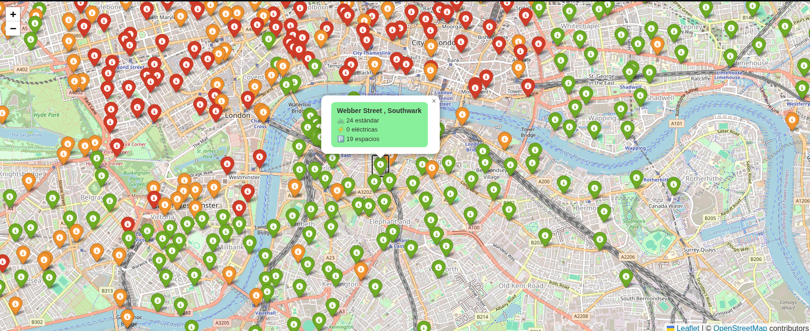

# Disponibilidad en Cicloestaciones de Londres

Aplicación web interactiva que implementa un pipeline **ETL** (Extract, Transform, Load) para consultar en tiempo real la disponibilidad de bicicletas y espacios en las cicloestaciones de Londres, visualizándolas sobre un mapa interactivo.

---

## ¿Cómo funciona?

El proyecto sigue el flujo básico de un ETL:

- **Extract** — Consume el endpoint `BikePoint` de la API pública de Transport for London (TfL): [`GET /BikePoint`](https://api-portal.tfl.gov.uk/api-details#api=BikePoint&operation=BikePoint_GetAll), que devuelve la información en tiempo real de todas las cicloestaciones de la ciudad.
- **Transform** — Limpia y estructura la respuesta JSON: extrae nombre, coordenadas, número de bicicletas estándar, bicicletas eléctricas, espacios disponibles y última actualización de cada estación.
- **Load** — Carga los datos procesados en un `DataFrame` de Pandas y los presenta en una interfaz web con mapa interactivo construida con Streamlit y Folium.

---

## Características

- Tiene un mapa interactivo con un marcador por cada cicloestación activa.
- Código de colores por disponibilidad:
  - **Verde** — más de 5 bicicletas disponibles
  - **Naranja** — entre 1 y 5 bicicletas disponibles
  - **Rojo** — sin bicicletas disponibles
- Popup por estación con detalle de bicicletas estándar, eléctricas y espacios libres.
- Botón para actualizar los datos en cualquier momento sin recargar la página.
- Marca de tiempo de la última actualización.

---

## Despliegue en Streamlit Cloud

Para desplegar en [Streamlit Cloud](https://streamlit.io/cloud), las variables de entorno deben configurarse desde **Settings → Secrets** del proyecto, en lugar del archivo `.env`:

---

## API utilizada

Este proyecto consume la API pública de **Transport for London (TfL)**:

| Campo | Detalle |
|---|---|
| Proveedor | Transport for London (TfL) |
| Endpoint | `GET /BikePoint` |
| Documentación | [api-portal.tfl.gov.uk](https://api-portal.tfl.gov.uk/api-details#api=BikePoint&operation=BikePoint_GetAll) |
| Autenticación | `app_id` + `app_key` como query params |
| Formato | JSON |

---

---

## Enlace

https://etl-bicis.streamlit.app/